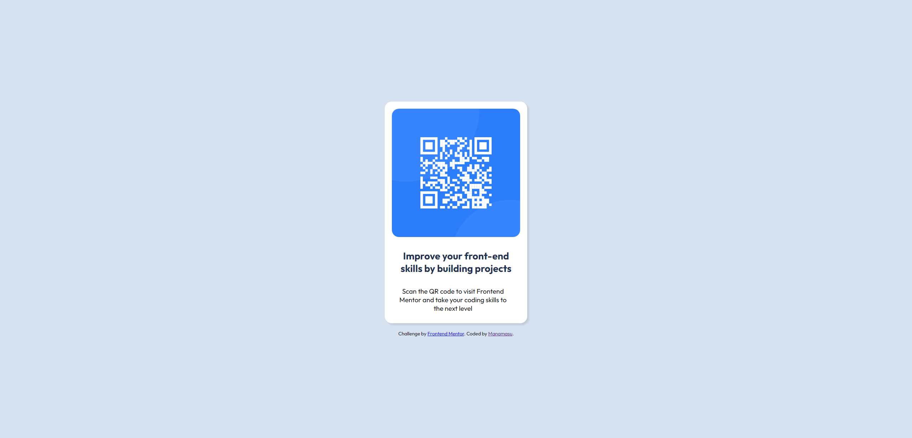

# Frontend Mentor - QR code component solution

This is a solution to the [QR code component challenge on Frontend Mentor](https://www.frontendmentor.io/challenges/qr-code-component-iux_sIO_H). Frontend Mentor challenges help you improve your coding skills by building realistic projects.

## Table of contents

- [Frontend Mentor - QR code component solution](#frontend-mentor---qr-code-component-solution)
  - [Table of contents](#table-of-contents)
  - [Overview](#overview)
    - [Screenshot](#screenshot)
    - [Links](#links)
  - [My process](#my-process)
    - [Built with](#built-with)
    - [What I learned](#what-i-learned)
    - [Continued development](#continued-development)
    - [Useful resources](#useful-resources)
  - [Author](#author)

**Note: Delete this note and update the table of contents based on what sections you keep.**

## Overview

### Screenshot

### Links

- Live Site URL: [https://frontend-mentor-manamasu-qr-code-component-7cyv8kxtj.vercel.app/]

## My process

### Built with

- Semantic HTML5 markup
- CSS custom properties
- Flexbox

### What I learned

I already had some CSS practice and experience, but I still refreshed my knowledge since it's been a while since I used plain CSS and not relied on component libraries.

### Continued development

In the future, I might use a similar card for QR codes or other topics. This project has given me a solid foundation to build upon for such use cases.

### Useful resources

- [Web.Dev](https://web.dev/learn/css) - This helped me

## Author

- Frontend Mentor - [@manamasu](https://www.frontendmentor.io/profile/manamasu)
